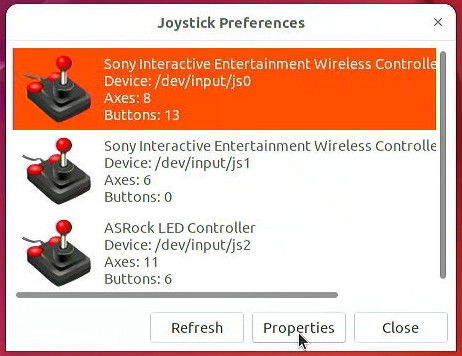
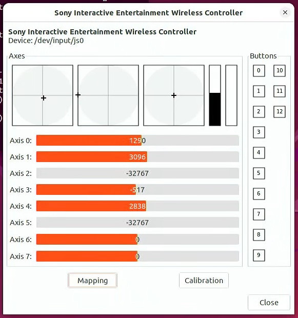
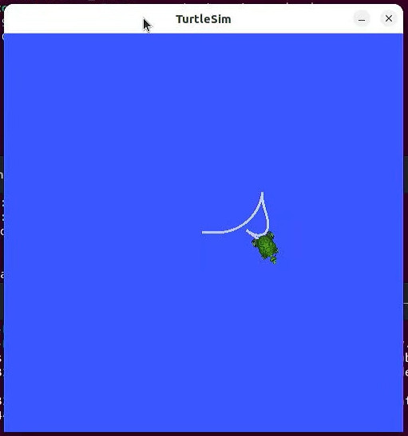

# Configure the controller using jstest-gtk and turtlebot

One of the ROS2 nodes that we run is responsible for converting joystick data into commands that move the robot. This node needs to know which controller to use and which axes/buttons do what. I like `jstest-gtk` for this as it is simple and complete. Feel free to use the application that suits you best.

## Using jstest-gtk

Install and run `jstest-gtk`:

```
sudo apt install -y jstest-gtk

jstest-gtk
```

Find your controller, open its properties, and check if the axes and buttons are being properly registered by the system. Note that the same controller may appear multiple times, for instance, DualSense shows a separate device for its motion controls.





Take note of the number of the device, the one that comes after `/dev/input/js`.

**Note: This number may change even if you unplug and plug the controller again.**

## Remapping axes/buttons

**Note: This step is optional if you have a DualSense controller and you don't want to remap anything. This mapping probably works with other Sony controllers and even generic controllers as well.**

Take note of which axes you want to use for forward/backward driving, for left/right turning, and the button to enable driving, in the same controller properties windows as before.

Edit `zero-to-slam/scripts/run-joy-teleop-dualsense.sh` and change the following parameters to match yours:

```
enable_button:=
axis_linear.x:=
axis_angular.yaw:=
```

## Running the joystick nodes

ROS2 has two nodes for handling the joystick input: One for collecting raw joystick data, and another for converting it into a `/cmd_vel` topic more suitable for driving robots.

You can start `rqt` with the Topic Monitor plugin to visualize the topics for the joystick being created in real time.

First, start a new joystick node replacing `X` with the device number of the controller from previous steps:

```
cd zero-to-slam/
./scripts/run-joy-node.sh X
```

The node will grab the raw data from the controller and should also print the information about the controller itself (a matching `/joy` topic should appear in rqt):

```
[INFO] [1715081712.990218224] [joy_node]: Opened joystick: Sony Interactive Entertainment Wireless Controller.  deadzone: 0.050000
```

Next, start the joystick teleop node to convert the raw data into `/cmd_vel`:

```
cd zero-to-slam/
./scripts/run-joy-teleop-dualsense.sh
```

It should print information about the axes/buttons you selected and `/cmd_vel` should also appear in rqt:

```
[INFO] [1715082801.037772012] [TeleopTwistJoy]: Teleop enable button 0.
[INFO] [1715082801.037809943] [TeleopTwistJoy]: Linear axis x on 1 at scale 0.500000.
[INFO] [1715082801.037818870] [TeleopTwistJoy]: Angular axis yaw on 0 at scale 0.500000.
```

## Running Turtlesim

Launch `turtlesim` to test if everything is working properly:

```
cd zero-to-slam/
./scripts/run-turtlesim-with-joy.sh
```

You can drive the turtle by holding the enable button on the controller and moving the axes.


