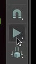
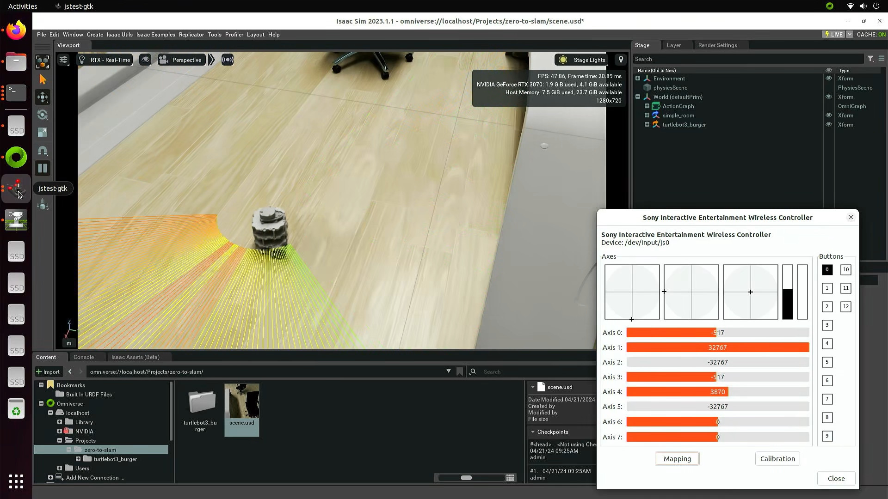

# Driving the Omniverse robot

Let's see if this part of the system works before we put together the navigation and SLAM nodes.

Start the joystick node (replacing `X` with the device number of the controller):

```
cd zero-to-slam/
./scripts/run-joy-node.sh X
```

Start the joystick teleop node:

```
cd zero-to-slam/
./scripts/run-joy-teleop-dualsense.sh
```

You can also use `jstest-gtk` and `rqt` to see if the inputs are being registered and the topics are being published.

Start Omniverse, start Isaac Sim with ROS2 extensions enabled, and load the `zero-to-slam` scene. Navigate through the scene until you have a clear view of the robot. Finally, start the simulation:



You should see LIDAR beams firing from the robot as it sits still. Press the drive button on the controller and start driving like you did with turtlebot:


