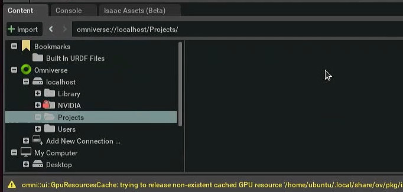
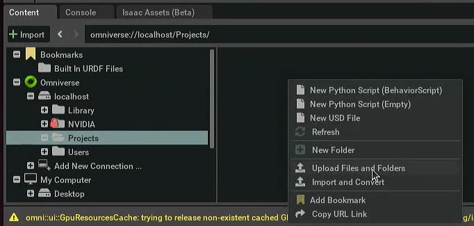
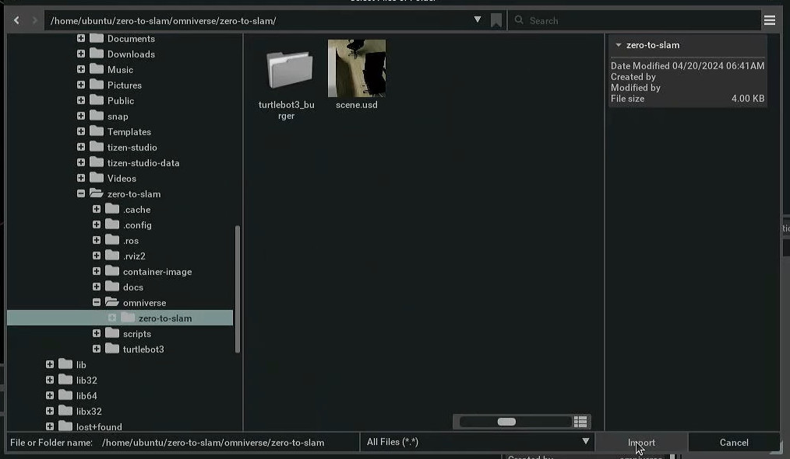
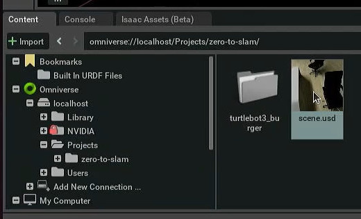

# Import zero-to-slam scene into Omniverse

Open Isaac Sim with ROS2 extensions enabled and, on the Content pane, select `Omniverse > localhost > Projects`:

Right-click on an empty space in the file listing and select `Upload Files and Folders`:

Navigate to `zero-to-slam/omniverse/`, select the `zero-to-slam` folder, and click `Import`:

Open the `zero-to-slam` folder in `Omniverse/localhost/Projects` and open `scene.usd`.

Fiddle with the scene! Fly around, inspect the turtlebot nodes, and open the action graph to see the ROS2 components that make everything work. You can also start the simulation (on the Play button) and see nothing relevant happening (Don't worry, we'll change that in the next steps).
