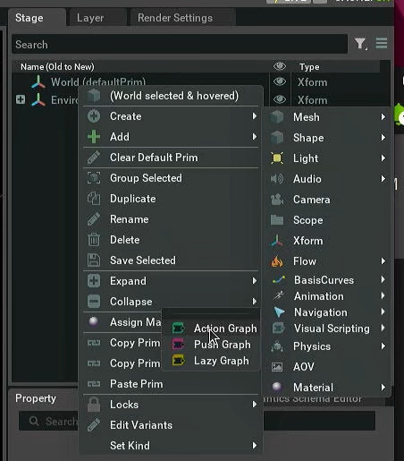
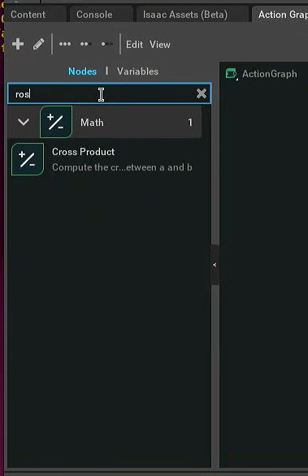
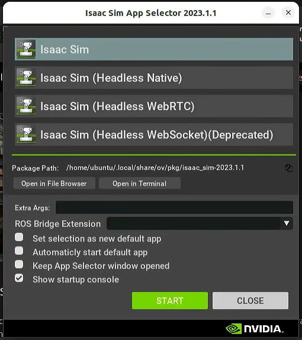
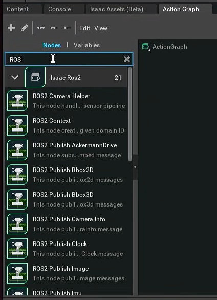

# Configure Isaac Sim to use its built-in ROS2

If you launch Isaac Sim using the Omniverse launcher, you will not find any ROS nodes in your action graph, that's because we are not installing the necessary ROS libraries in the system itself, but rather using the ROS2 container. Isaac Sim comes with its own ROS2 libraries that must be explicitly activated before launch through environment variables.





You can manually export these variables before running the Omniverse launcher (that may not always work because the Omniverse launcher likes to autostart when you log in), or you can use the provided script `zero-to-slam/scripts/run-isaac-ros2.sh`.

If you kept the default directories during Omniverse configuration, then it is likely that the script will work out of the box. Otherwise, edit `run-isaac-ros2.sh` to change the value of the `ISAAC_PATH` variable:

```
export ISAAC_PATH=$HOME/.local/share/ov/pkg/isaac_sim-2023.1.1
```

With the one that is displayed in `Package Path` on the Isaac Sim launcher:



**Important: Always make sure Omniverse is running, even if you are running Isaac Sim using scripts!**

Close the Isaac Launcher window and start Isaac Sim using `run-isaac-ros2.sh` instead:

```
cd zero-to-slam/
./scripts/run-isaac-ros2.sh
```

Check if the ROS2 nodes are available for use in the action graph:


