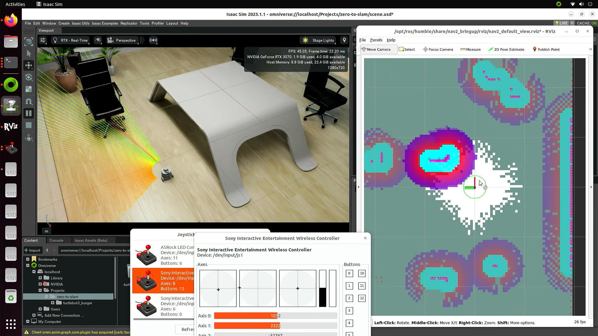
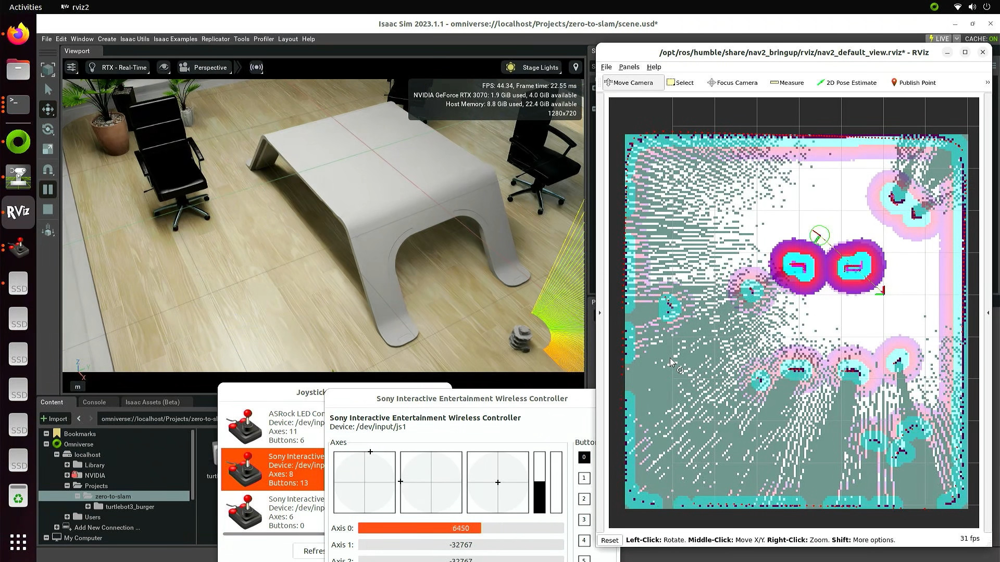
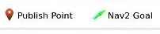
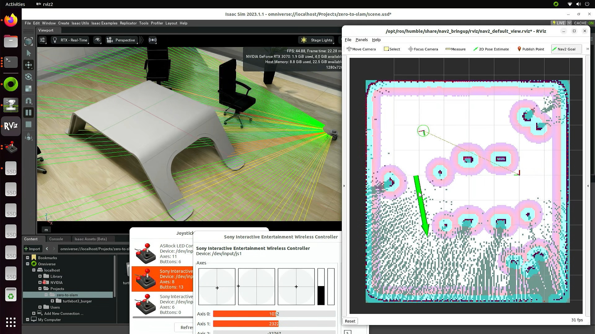
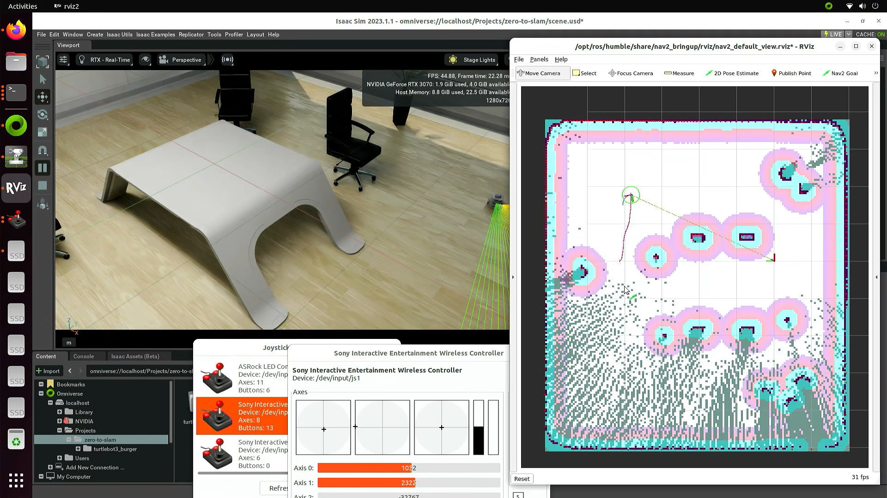
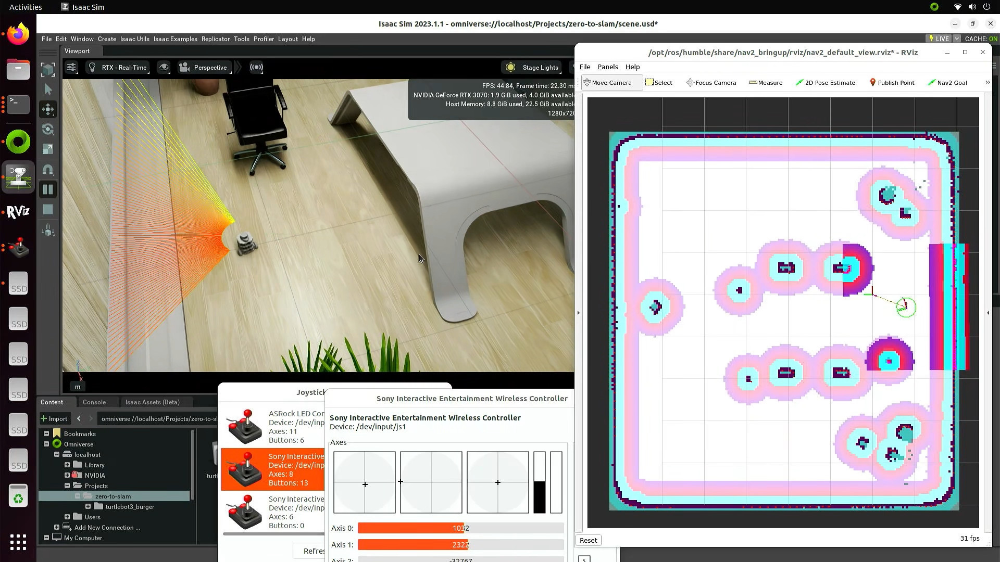

# Navigation and SLAM

Here we will combine the manual driving that we achieved before with the ability to map the environment and automatically trace routes. There are several ways to map the environment and here we'll use a LIDAR installed on top of the robot.

## Setup

Start the joystick node (replacing `X` with the device number of the controller):

```
cd zero-to-slam/
./scripts/run-joy-node.sh X
```

Start the joystick teleop node:

```
cd zero-to-slam/
./scripts/run-joy-teleop-dualsense.sh
```

Start the nav2 node:

```
cd zero-to-slam/
./scripts/launch-nav2.sh
```

Start the slam_toolbox node:

```
cd zero-to-slam/
./scripts/launch-slam_toolbox.sh
```

Start the RViz application to visualize the data and set navigation targets (it should show just an empty grid):

```
cd zero-to-slam/
./scripts/run-rviz-nav2.sh
```

## Driving the robot

Start Omniverse, start Isaac Sim with ROS2 extensions enabled, load the `zero-to-slam` scene, and start the simulation. At this point, RViz should start showing the inner workings of the navigation and slam system:



Start driving the robot around and you will see the map revealing itself as you move:



## Self-driving and Nav Goals

Now let's try to fill the remaining parts of the map by picking points on the map and letting the robot decide how to get to them. Go to the RViz window and look for the `Nav2 Goal` button:



Click and drag on a point of the map to create a position goal and a direction goal for the robot (yes you can tell it where to face as well). And watch the robot build a trajectory and follow it by itself.

**Note: There must be enough map filled between the robot's position and its destination for it to build the trajectory!**





If the robot fails to follow the trajectory, you can just put a different goal and the robot will abandon the old one.

Keep mixing driving and setting goals until the map is mostly filled:



## Saving the map for later use

Our efforts to make this map should not go to waste. One of the great advantages of `slam_toolbox` is the ability to save the current map as something that can later be loaded and updated with new data, as real-world maps are rarely static. To save a snapshot of the current state of the map:

```
cd zero-to-slam/
./scripts/save-map-posegraph.sh my_map
```

You will see two new files, `my_map.data` and `my_map.posegraph` appear inside the `zero-to-slam` folder.
