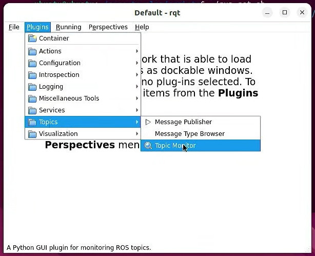
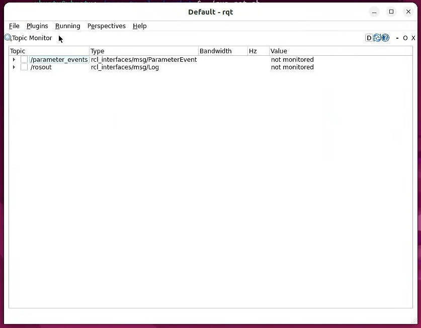

# Configure rqt

The rqt framework allows us to visualize various aspects of the ROS inner workings. Here we will configure it to show the ROS topics published/subscribed by the nodes.

Open rqt:

```
cd zero-to-slam/
./scripts/run-rqt.sh
```

Select `Plugins > Topics > Topic Monitor`



The window will change to the Topic Monitor:



Be sure to check the checkbox before the topic name to monitor topics as new data is published.
