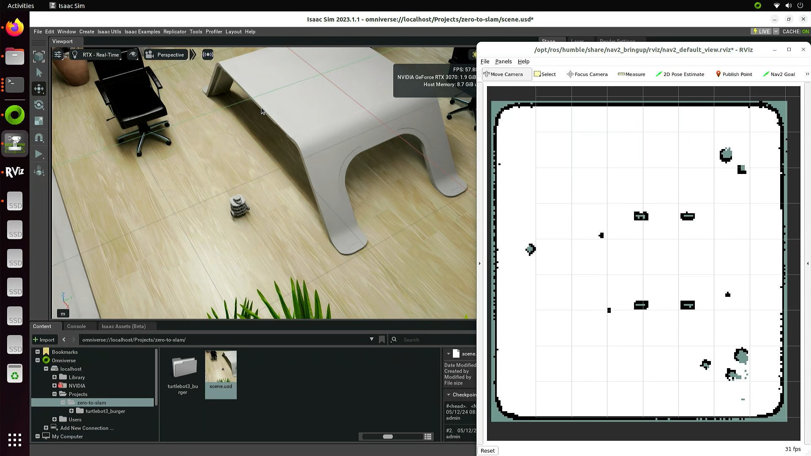

# Reusing a saved map

The `slam_toolbox` package allows us to load previous maps and continue updating them with new data. You should have a posegraph file and a data file if you followed the previous section.

## Setup

This time we won't be using the controller to drive the robot around, just Nav Goals.

Start the nav2 node:

```
cd zero-to-slam/
./scripts/launch-nav2.sh
```

Start the slam_toolbox node:

```
cd zero-to-slam/
./scripts/launch-slam_toolbox.sh
```

Start the RViz application to visualize the data and set navigation targets (it should show just an empty grid):

```
cd zero-to-slam/
./scripts/run-rviz-nav2.sh
```

Start Omniverse, start Isaac Sim with ROS2 extensions enabled, and load the `zero-to-slam` scene, **but do not start the simulation yet!**

Let's add some furniture to our scene:


**Note: Make sure the furniture is taller than the robot's LIDAR position, otherwise it won't detect it.**

## Loading the previous map

To load the posegraph saved earlier:

```
cd zero-to-slam/
./scripts/load-map-posegraph.sh my_map
```

RViz should now contain the map generated from the previous run, but without any additional information (most of it comes from nav2 instead of slam_toolbox):



In my scene, the new furniture is on the top-right corner of the map (not updated yet).

## Updating the map

Start the Isaac Sim simulation and set the Nav Goal towards the modified area of the scene. It will drive to that location and modify the map to include de new obstacles:


If the trajectory happens to be inside the new obstacles, then it will dynamically change the route, that's the power of SLAM.

## Saving the updated the map

You can save the updated map just as you did before:

```
cd zero-to-slam/
./scripts/save-map-posegraph.sh my_map_2
```
